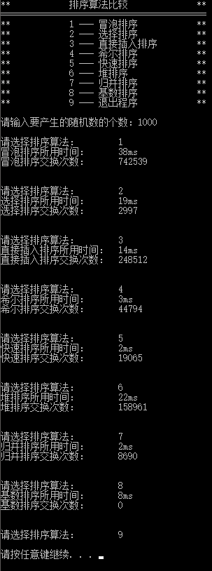
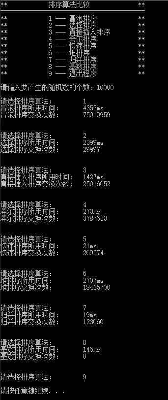
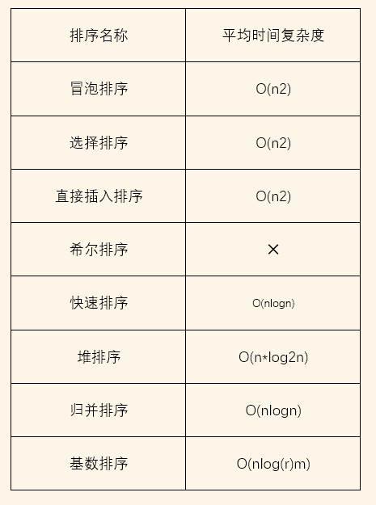

# 排序
## 1 项目功能分析
### 1.1 项目简介
随机函数产生一百，一千，一万和十万个随机数，用快速排序，直接插入排序，冒泡排序，选择排序的排序方法排序，并统计每种排序所花费的排序时间和交换次数。其中，随机数的个数由用户定义，系统产生随机数。并且显示他们的比较次数。
### 1.2 项目功能

## 2 程序设计
### 2.1 数据结构设计
**class Datalist**
|类型|名称|说明|
|:-:|:-:|:-:|
|int|total|存储Datalist的数据长度|
|int*|data|动态数组指针|

|函数名称|说明|
|:-:|:-:|
|void showDatalist()|用于debug，显示数组存储状态|
|void operator=(const Datalist& list)|用于datalist的赋值|
|int& operator[](int i)|取出datalist中第i个元素|

**class Sort**
|类型|名称|说明|
|:-:|:-:|:-:|
|Datalist|datalist|存储数据表|

|函数名称|说明|
|:-:|:-:|
|void bubbleSort(Datalist& list, unsigned long long& t)|冒泡排序|
|void selectSort(Datalist& list, unsigned long long& t)|选择排序|
|void insertionSort(Datalist& list, unsigned long long& t)|插入排序|
|void shellSort(Datalist& list, unsigned long long& t)|希尔排序|
|void quickSort(Datalist& list, int start, int end, unsigned long long& t)|快速排序|
|void heapSort(Datalist& list, unsigned long long& t)|堆排序|
|void mergeSort(Datalist& list, unsigned long long& t)|归并排序|
|void radixSort(Datalist& list)|基数排序|
|
|void instruct()|输出程序操作指引|
|char choice()|根据不同的输入跳到不同的排序操作|
|
|void swap(int&a, int&b)|交换a、b的值|
|void radixSort(node* &P, int baseNum)|基数排序（递归）|
|int findMaxBase(Datalist& list)|找到基数排序最大的基数|
|void heapAdjust(Datalist& list, int i, int size, unsigned long long& t)|堆排序从上至下调整|

### 2.2 程序设计

**冒泡排序bubbleSort**
```c
void Sort::bubbleSort(Datalist& list, unsigned long long& t)
{
    for (int i = 0; i < list.total - 1; i++)
    {
        for (int j = 0; j < list.total - i - 1; j++)
        {
            if (list[j] > list[j + 1])
            {
                int temp = list[j];
                list[j] = list[j + 1];
                list[j + 1] = temp;
                t += 3;
            }
        }
    }
}
```

**选择排序selectSort**
```c
void Sort::selectSort(Datalist& list, unsigned long long& t)
{
    for (int i = 0; i < list.total - 1; i++)
    {
        int min_index = i;
        for (int j = i; j < list.total; j++)
        {
            if (list[min_index] > list[j])
            {
                min_index = j;
            }
        }
        int temp = list[i];
        list[i] = list[min_index];
        list[min_index] = temp;
        t += 3;
    }
}
```
**插入排序insertionSort**
```c
void Sort::insertionSort(Datalist& list, unsigned long long& time)
{
    for (int t = 1; t < list.total; t++)
    {
        int temp = list[t];
        int i = t - 1;
        while (temp < list[i] && i >= 0)
        {
            list[i + 1] = list[i];
            time++;
            i--;
        }
        list[i + 1] = temp;
        time++;
    }
}
```

**希尔排序shellSort**
```c
void Sort::shellSort(Datalist& list, unsigned long long& time)
{
    int gap = 7;
    while (gap >= 1)
    {
        //gap==N时的几个子序列都排好序
        int start = gap - 1;
        while (start >= 0)
        {
            for (int t = start + gap; t < list.total; t += gap)
            {
                int temp = list[t];
                int i = t - gap;
                while (temp < list[i] && i >= 0)
                {
                    list[i + gap] = list[i];
                    i -= gap;
                    time++;
                }
                list[i + gap] = temp;
                time++;
            }
            start--;
        }
        if (gap == 1)
        {
            break;
        }
        gap /= 2;
    }
}

```

**快速排序quickSort**
```c
void Sort::quickSort(Datalist& list, int start, int end, unsigned long long& t)
{
    if (end <= start)
    {
        return;
    }
    else
    {
        int mid = start;
        for (int i = start; i <= end; i++)
        {
            if (list[i] < list[mid])
            {
                int temp = list[mid];
                list[mid] = list[i];
                list[i] = list[mid + 1];
                list[mid + 1] = temp;
                t += 3;
                mid++;
            }
        }
        quickSort(list, start, mid - 1, t);
        quickSort(list, mid + 1, end, t);
    }
}

```

**堆排序heapSort**
```c
void Sort::heapSort(Datalist& list, unsigned long long& t)
{
    int i = 1;
    //找到最大树节点
    while (i * 2 - 1 < list.total)
    {
        i *= 2;
    }
    i = i / 2 - 1;
    //构造最大堆
    while (i > -1)
    {
        heapAdjust(list, i, list.total, t);
        i--;
    }
    int size = list.total;
    //交换
    while (size > 1)
    {
        swap(list[0], list[size - 1]);//list最后一个数最大
        size -= 1;
        heapAdjust(list, 0, size, t);
    }
}

```
**归并排序mergeSort**
```c
void Sort::mergeSort(Datalist& list, unsigned long long& t)
{
    int size = 1;
    while (size < list.total)//size
    {
        int first = 0;
        int second = 0 + size;
        while (first < list.total)//first second
        {
            //compare
            int a = first;
            int b = second;
            int* temp = new int[2 * size];
            int temp_i = 0;
            while (a < second&&b < second + size && b < list.total)//ab不为空
            {
                if (list[a] < list[b])
                {
                    temp[temp_i] = list[a];
                    temp_i++;
                    a++;
                    t++;
                }
                else
                {
                    temp[temp_i] = list[b];
                    temp_i++;
                    b++;
                    t++;
                }
            }
            while (a < second&&a < list.total)//a不为空
            {
                temp[temp_i] = list[a];
                temp_i++;
                a++;
            }
            while (b < second + size && b < list.total)//b不为空
            {
                temp[temp_i] = list[b];
                temp_i++;
                b++;
            }
            //copy
            int i = 0;
            int j = first;
            while (j < second + size && j < list.total)
            {
                list[j] = temp[i];
                i++;
                j++;
            }
            delete[]temp;
            //next 2
            first += 2 * size;
            second += 2 * size;
        }
        size *= 2;
    }
}

```
**基数排序radixSort**
```c
void Sort::radixSort(Datalist& list)
{
    int baseNum = findMaxBase(list);
    //list转换成链表first
    node* first = new node(list[0]);
    int i = 1;
    node* p = first;
    while (i < list.total)
    {
        p->next = new node(list[i]);
        p = p->next;
        i++;
    }
    //radixSort
    radixSort(first, baseNum);
    //链表转化成list
    i = 0;
    p = first;
    while (p != nullptr && i < list.total)
    {
        list[i] = p->value;
        i++;
        p = p->next;
    }
}

```
## 3 运行状况
### 3.1 测试功能
**n=1000**



**n=10000**



## 4 说明
该排序程序主要输出两部分：其一是排序所用的时间，其二是排序中程序的交换次数。



基本上，程序所示结果时间复杂度与通过数学方式得出的排序算法时间复杂度相当，但很多算法中耗费时间的往往是数据比较而不是数据交换，所以个人认为数据交换次数并没有太高的参考价值。其中希尔排序的时间复杂度根据不同的希尔序列差别很大，且暂时无法通过数学计算的方式得出，故不列出。

冒泡排序作为最基本的排序算法，是一个稳定的排序算法。但时间复杂度过高，数据很大时耗时长。

选择排序是一个不稳定的排序方法。虽然比较次数很多，但是选择排序的数据交换次数固定是n-1次。时间复杂度也很大，耗时很长。

插入排序是一个稳定的算法。其时间复杂度也很高。当数据特别庞大时，每次插入都要移动很多的数据。

希尔排序的排序速度从慢到快。后期序列已经基本上处在正确的顺序中，需要进行移动的地方很少。但它是一个不稳定的排序算法。

快速排序是目前已知的最快排序方法，是一种不稳定的排序方式。当数据较少时，快速排序反而没有其他排序方式表现得出色，但是当数据非常多时，快速排序的速度要远远快于其它排序。

堆排序的时间复杂度相对来说比较平庸，所耗时间也冒泡排序要短，但是比快速排序要长。是一种不稳定的排序算法。

归并排序耗时也比较长，而且空间复杂度很高，要划分新的空间存储新的“集合”。归并排序的集合内使用的是直接插入排序，因此是一种稳定的排序算法

基数排序是一种稳定的排序算法，而且速度仅次于快速排序。

总而言之，当数据集大时，优先考虑快速排序。如果对序列有“稳定”的需求，可以选择基数排序。