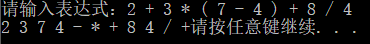
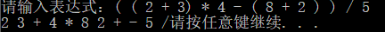
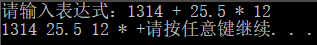
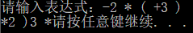

# 表达式转换
## 1 项目功能分析
### 1.1 项目简介
算数表达式有前缀表示法，中缀表示法和后缀表示法等形式。日常使用的算术表达式是采用中缀表示法，即二元运算符位于两个运算数中间。请设计程序将中缀表达式转换成为后缀表达式。
### 1.2 项目功能
输入中缀表达式，将其转换成为后缀表达式并输出。
## 2 程序设计
### 2.1 数据结构设计
**struct symbol**
|成员|类型|说明|
|:-:|:-:|:-:|
|_symbol|char|存储对应的运算符号|
|value|int|存储该运算符号的优先级|

|函数名称|说明|
|:-:|:-:|
|symbol(char x)|struct symbol的构造函数，根据不同的符号初始化该符号的优先级。|
|void operator=(char x)|重构运算符=，根据x改变value。|
|bool operator>=(symbol x)|重构运算符>=，实际上是this->value和x.value的比较（优先级之间的比较）。|
|bool operator==(symbol x)|重构运算符==，实际上是this->value和x.value的比较（优先级之间的比较）。|
|bool operator!=(char x)|重构运算符!=，判断该符号是不是x。|
**class Expression**
|类型|名称|说明|
|:-:|:-:|:-:|
|vector\<symbol>|Symbol|存储运算符号|
|vector\<char>|Bracket|存储括号|
|vector\<string>|Digit|存储数字|

|函数名称|说明|
|:-:|:-:|
|void **Input**()|输入中缀表达式，根据表达式内容初始化Symbol、Bracket、Digit三个容器。|
|bool **Build**()|Build()函数内执行把中缀表达式转换成后缀表达式的过程。|

### 2.2 程序设计
**程序设计的思想：** 

该程序的思路较为复杂。

主要判断需要依靠运算符的优先级进行。在Input()初始化的过程中，如果检测到一组括号，则把括号中的运算符优先级增大（例如括号中的+、-运算符优先级要高于括号外的*、/运算符）。

构造后缀表达式时，先依次遍历Symbol数组，如果某一个运算符的优先级比它前、后两个运算符（如果存在的话）都大，则它可以联合其附近的两个运算数作为一个新的运算数共同参与其后的运算，在转化成新的运算数时就可以改为后缀表达式。

反复执行以上操作，直到Symbol数组只剩下最后一个符号，连接最后的两个“运算数”和符号，就形成了最终的后缀表达式。
#### 操作：Input()初始化容器、算符优先级
**主要代码：** 
```c
void Expression::Input()
{
    int bracketValue = 0;//用于计算括号层次，判断括号中的运算符优先级
    //……
    while (true)
    {
        //判断是不是空
        if (x==length)
        {
            //结束输出
            break;
        }
        //判断是不是运算符号
        else if (str[x] == '+' || str[x] == '-' || str[x] == '*' || str[x] == '/')
        {
            //……
        }
        //判断是不是括号，改变优先级
        else if (str[x] == '{' || str[x] == '[' || str[x] == '(')
        {
            Bracket.push_back(symbol(str[x]));
            bracketValue += 2;
            //特别的，检测到‘-’/‘+’号说明是带符号数
            if (str[x + 1] == '-')
            {
                //……
            }
        }
        //判断是不是数字
        else if (str[x] <= '9' && str[x] >= '0')
        {
            //……
        }
        else if (str[x] == '}' || str[x] == ']' || str[x] == ')')
        {
            Bracket.pop_back();
            bracketValue -= 2;
        }
        x++;
    }
}
```
#### 操作：Build()构造后缀表达式
**主要代码：** 
```c
bool Expression::Build()
{
    auto SymbolIter = Symbol.begin();
    auto DigitIter = Digit.begin();
    while (true)
    {
        //最后一步
        if (Symbol.size()==1)
        {
            //……
            break;
        }
        //如果当前指向的运算符优先级最高，归约
        else if (SymbolIter + 1 == Symbol.end() || *SymbolIter >= *(SymbolIter + 1))
        {
            //构建新的“运算数”
            string newDigit = "";
            newDigit = *DigitIter + *(DigitIter + 1) + SymbolIter->_symbol + ' ';
            *DigitIter = newDigit;
            //删除原运算符和运算数
            Digit.erase(DigitIter+1);
            if(DigitIter!=Digit.begin())DigitIter--;
            if (SymbolIter != Symbol.begin())
            {
                SymbolIter--;
                Symbol.erase(SymbolIter + 1);
            }
            else
            {
                SymbolIter = Symbol.erase(SymbolIter);
            }
        }
        else
        {
            //迭代
            SymbolIter++;
            DigitIter++;
        }
    }
    return true;
}
```
## 3 运行状况
### 3.1 测试功能
**正常测试6中运算符：**



**嵌套括号：**



**运算数超过1位整数且有非整数出现：**



**运算数有正或负号：**



**只有1个数字：**


### 3.2 测试数据
**正常测试6中运算符：**
```
2 + 3 * ( 7 – 4 ) + 8 / 4
```
**嵌套括号：**
```
( ( 2 + 3) * 4 – ( 8 + 2 ) ) / 5
```
**运算数超过1位整数且有非整数出现：**
```
1314 + 25.5 * 12
```
**运算数有正或负号：**
```
-2 * ( +3 )
```
**只有1个数字：**
```
123
```