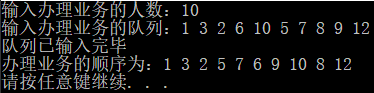
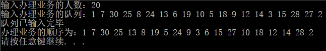
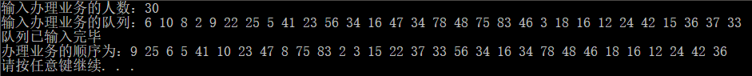

# 银行业务
## 1 项目功能分析
### 1.1 项目简介
设某银行有A，B两个业务窗口，且处理业务的速度不一样，其中A窗口处理速度是B窗口的2倍——即当A窗口每处理完2个顾客是，B窗口处理完1个顾客。给定到达银行的顾客序列，按照业务完成的顺序输出顾客序列。假定不考虑顾客信后到达的时间间隔，并且当不同窗口同时处理完2个顾客时，A窗口的顾客优先输出。
### 1.2 项目功能
给定来到该银行办理业务的顾客人数和序列，按要求输出他们业务完成的顺序。
## 2 程序设计
### 2.1 数据结构设计
**class bank**
|类型|名称|说明|
|:-:|:-:|:-:|
|vector\<int>|A|利用动态数组保存到A窗口办理的顾客序列|
|vector\<int>|B|利用动态数组保存到B窗口办理的顾客序列|
### 2.2 程序设计
该程序相对较简单，因为A窗口处理的速度是B窗口处理的速度的2倍，因此只需要按顺序输出2个A序列的数据和1个B序列的数据即可。若某序列全部输出完毕，则直接输出另一个序列的剩下数据。
#### 操作：创建序列
**主要代码：**
```c
int temp;
for (int i = 0; i < n; i++)
{
    cin >> temp;
    //奇数入A序列
    if (temp % 2 == 1)
    {
        A.push_back(temp);
    }
    //偶数入B序列
    else
    {
        B.push_back(temp);
    }
}
```
#### 操作：输出序列
**主要代码：**
```c
//输出办理业务顺序
auto iterA = A.begin();
auto iterB = B.begin();
//当AB俩序列都不为空
//flag==1说明A序列还没输出完
//flag==2说明B序列还没输出完
int flag = 0;
while (true)
{
    if (iterA == A.end())
    {
        if (iterB == B.end())
        {
            flag = 0;
            break;
        }
        else
        {
            flag = 2;
            break;
        }
    }
    if (iterB == B.end())
    {
        flag = 1;
        break;
    }
    cout << *iterA << ' ';
    iterA++;
    if (iterA == A.end())
    {
        flag = 2;
        break;
    }
    cout << *iterA << ' ';
    cout << *iterB << ' ';
    iterA++;
    iterB++;
}
//根据flag的情况依次输出还有数据的序列
if (flag == 1)
{
    while (*iterA != A.back())
    {
        cout << *iterA << ' ';
        iterA++;
    }
    cout << *iterA;
}
else if (flag == 2)
{
    while (*iterB != B.back())
    {
        cout << *iterB << ' ';
        iterB++;
    }
    cout << *iterB;
}
```
## 3 运行状况
### 3.1 测试功能
**第一次测试：** 



**第二次测试：**



**第三次测试：** 



### 3.2 测试数据
**第一次测试：** 
```
10
1 3 2 6 10 5 7 8 9 12
```
**第二次测试：**
```
20
1 7 30 25 8 24 13 6 19 10 5 18 9 12 14 3 15 28 27 2
```
**第三次测试：** 
```
30
6 10 8 2 9 22 25 5 41 23 56 34 16 47 34 78 48 75 83 46 3 18 16 12 24 42 15 36 37 33 
```