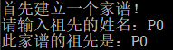
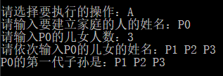
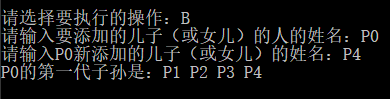
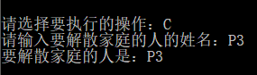
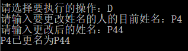
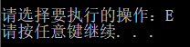

# 家谱管理系统
## 1 项目功能分析
### 1.1 项目简介
家谱是一种以表谱形式，记载一个以血缘关系为主体的家族世袭繁衍和重要任务事迹的特殊图书体裁。家谱是一种本项目对家谱管理进行简单的模拟，以实现查看祖先和子孙个人信息、插入家族成员，删除家族成员的功能。
### 1.2 项目功能
- 新建家谱，输入整支家族树的祖先
- 为家族树中的个人添加子女
- 新建家庭
- 解散家庭
- 更改家族树中的个人信息（名字等）
## 2 程序设计
### 2.1 数据结构设计
**struct Member**
|成员|类型|说明|
|:---:|:---:|:---:|
|name|string|存储该成员的名字|
|child|Member*|存储指向长子（女）的指针|
|neighbor|Member*|存储指向兄弟的指针|

|函数名字|说明|
|:---:|:---:|
|void appendChild(Member*m)|给当前节点添加子孙，相当于对其长子女添加neighbor。
|void appendNeighbor(Member* m)|给当前节点添加兄弟节点，即把兄弟节点添加到它neighbor的链表末端。

采用“左子女右兄弟”的数据结构实现方式。

**class Family**
|成员|作用范围|类型|说明|
|:---:|:---:|:---:|:---:|
|forest|public|vector<Member*>|forest第一个元素存储以祖先为首的家族树，其它新创建未加入的家庭存储在后面的元素中。|

|函数名字|作用范围|说明|
|:---:|:---:|:---:|:---:|
|void **Begin()**|private|输出操作指令的说明，并在提示下创建家谱的祖先和forest中的第一棵树。|
|void **Struction()**|private|提示输入选择执行的操作，根据输入进行不同的操作。|
|Member* **find**(string name)|private|查询所有树、所有节点，找到名字为name的Member。|
|Member* **findUpper**(string name)|private|查询所有树、所有节点，找到有子女名字为name的Member。|
|Member* **findUpper**(Member* member)|private|查询所有树、所有节点，找到子女member的父节点。|
|Member* **findTree**(string name)|private|搜索forest中每棵树的祖先节点，即找到祖先名字为name的家庭。|
|void **deleteAll**()|private|对forest每个祖宗节点调用deleteMember()，删除所有树。
|void **deleteMember**(Member* member)|private|对member节点及其子女节点递归调用deleteMember()，删除子树。
主要通过Struction()函数来实现相应操作，其它函数为辅助函数。
### 2.2 程序设计
#### 操作A - 完善家谱
**功能：** 建立一个家庭。如果祖先已经存在于某一棵家族树中，直接对其添加子女；如果祖先之前没有出现过，则创建一棵新的家族树，添加至forest中。

**主要代码：** 

```c
//判断祖先节点是否已知
Member* father = find(name);
if (father == nullptr)
{
    father = new Member(name);
    forest.push_back(father);
}

//为该父节点father添加子女
for (int i = 0; i < number; i++)
{
    string childname;
    cin >> childname;
    Member* child = new Member(childname);
    father->appendChild(child);
}
```
#### 操作B - 添加家庭成员
**功能：** 在forest中找到父/母亲的Member节点（father节点），为其添加子女。如果子女已经存在于某一棵家族树当中（即是某一个家庭的家长），则从forest中删除该家庭，并将它移植到father节点下。

**主要代码：** 
```c
//找到父节点father
Member* father = find(fatherName);

//判断child是否已知，添加到father节点下
Member* child = findTree(childName);
if (child == nullptr)child = new Member(childName);
father->appendChild(child);
```
#### 操作C - 解散局部家庭
**功能：** 在forest中找到对应节点，删除father节点及其子树。

**主要代码：** 
```c
Member* father = find(fatherName);
deleteMember(father);

//deleteMember()
Member*m = member;
Member* upperNode = findUpper(member);
if (upperNode != nullptr)
{
  if(upperNode->child == member)upperNode->child = nullptr;
  else if (upperNode->neighbor == member)upperNode->neighbor = nullptr;
}
stack<Member*> node;
node.push(m);
while (node.size() != 0)
{
  Member* ptr = node.top();
  node.pop();
  if (ptr->child != nullptr)
  {
    node.push(ptr->child);
  }
  if (ptr->neighbor != nullptr)
  {
    node.push(ptr->neighbor);
  }
  delete(ptr);
}
```

#### 操作D - 更改家庭成员姓名
**功能：** 根据名字找到对应的家庭成员，修改他/她的姓名。

**主要代码：** 
```c
find(name)->name = nameAlter;
```
#### 操作E - 退出程序
**功能：** 跳出输入操作的循环。
## 3 运行状况
### 3.1测试功能
#### 建立家谱

#### 完善家谱

#### 添加家庭成员

#### 解散局部家庭

#### 更改家庭成员姓名

#### 退出程序

### 3.2测试数据

```
P0
A
P0
3
P1 P2 P3
B
P0
P4
B
P4
P41
C
P3
D
P4
P44
```