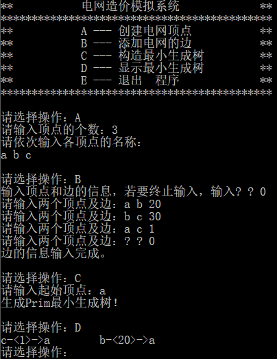
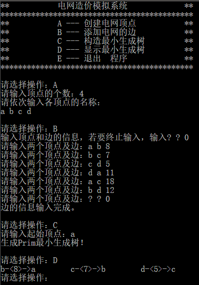

# 电网造价模拟系统
## 1 项目功能分析
### 1.1 项目简介
假设一个城市有n个小区，要实现n个小区之间的电网都能够相互接通，构造这个城市n个小区之间的电网。设计一个程序，协助计算出一种建造方式，能够使总工程造价最低。
### 1.2 项目功能
在每个小区之间都可以设置一条电网线路，都要付出相应的经济代价。n个小区之间最多可以有n（n-1）/2条线路，选择其中的n-1条使总的耗费最少。
## 2 程序设计
### 2.1 数据结构设计
**class Node**
|类型|名称|说明|
|:-:|:-:|:-:|
|char|name|存储点的名称|
|int|index|存储点的序号|

|函数名称|说明|
|:-:|:-:|
|char getName()|返回name|
|int getIndex()|返回index|
|void setName(char _name)|设置name|
|void setIndex(int _index)|设置index|
因为程序输入时点的命名不是数字，因此设置Node类，将名称和一个编码（按照点输入的顺序）关联起来，便于后续访问数组等其它操作，最后输出时再由编码反向找到对应点的名称即可。

**class Edge**
|类型|名称|说明|
|:-:|:-:|:-:|
|int|length|存储边的长度|
|char|start|边的一个结点|
|char|end|边的另一个结点|

**class Web**
|类型|名称|说明|
|:-:|:-:|:-:|
|int|nodeNum|存储结点个数|
|Node*|nodeList|一维动态数组，存储所有结点。|
|vector<Edge>|edge|存储最终选中的边|
|int**|cost|二维动态数组，存储边的权。|
|bool*|nearVec|表示该点是否已经选中|
|int*|lowCost|一维动态数组，存储其它点到已知点的最小距离。|
|int|count|计算当前已经选中的结点个数，当count==nodeNum时，说明最小生成树已经构建完成。|

|函数名称|说明|
|:-:|:-:|
|void construction()|输出指导操作信息|
|void buildTree()|建立最小生成树|
|void showTree()|展现最小生成树|
|int getIndex(char name)|找到对应名称的结点编码|
|char getName(int index)|找到对应编码的结点名称|

### 2.2 程序设计
**void construction()**
```c
void Web::construction()
{
    char input;
    bool flag = 1;

    while (flag)
    {
        cout << endl << "请选择操作：";
        cin >> input;

        switch (input)
        {
            //输入顶点信息
        case'A':
            cout << "请输入顶点的个数：";
            cin >> nodeNum;
            nodeList = new Node[nodeNum];
            cout << "请依次输入各顶点的名称：" << endl;
            char _name;
            //创建顶点和相关信息
            for (int i = 0; i < nodeNum; i++)
            {
                cin >> _name;
                nodeList[i].setName(_name);
                nodeList[i].setIndex(i);
            }
            //初始化
            nearVec = new bool[nodeNum];
            lowCost = new int[nodeNum];
            cost = new int*[nodeNum];
            for (int i = 0; i < nodeNum; i++)
            {
                nearVec[i] = 0;
                lowCost[i] = INT_MAX;
                cost[i] = new int[nodeNum];
                for (int j = 0; j < nodeNum; j++)
                {
                    cost[i][j] = INT_MAX;
                }
            }

            break;
            //输入顶点的边的信息
        case'B':
            cout << "输入顶点和边的信息，若要终止输入，输入? ? 0" << endl;
            while (true)
            {
                char a, b;
                int l;
                cout << "请输入两个顶点及边：";
                cin >> a >> b >> l;

                if (a == '?'&&b == '?'&&l == 0)
                {
                    cout << "边的信息输入完成。" << endl;
                    break;
                }
                else
                {
                    int indexA = getIndex(a);
                    int indexB = getIndex(b);
                    cost[indexA][indexB] = cost[indexB][indexA] = l;
                }
            }
            break;

            //输入起始顶点并生成Prim最小生成树
        case'C':
            cout << "请输入起始顶点：";
            char start;
            cin >> start;
            nearVec[getIndex(start)] = 1;
            count++;
            buildTree();
            cout << "生成Prim最小生成树！" << endl;
            break;
            //显示最小生成树
        case'D':
            showTree();
            break;
            //退出程序
        case'E':
            flag = 0;
            break;
        }
    }
}
```
construction()中包含了程序初始化的部分。例如A操作和B操作，创建电网顶点和添加电网的边这两部分的代码直接写在construction()里。因为本程序较小，本身逻辑结构就很清晰，故而没有单独调用其它函数的必要。

**void buildTree() 构建最小生成树**
```c
void Web::buildTree()
{
    //存储离未知点i最小距离的已知点j
    int* lowCostNode = new int[nodeNum];
    //update lowCost
    //找未知点i到已知点j的最小距离
    for (int i = 0; i < nodeNum; i++)
    {
        if (nearVec[i] == 1)continue;
        for (int j = 0; j < nodeNum; j++)
        {
            if (nearVec[j] != 1)continue;
            if (cost[i][j] <= lowCost[i])
            {
                lowCost[i] = cost[i][j];
                lowCostNode[i] = j;
            }
        }
    }

    //根据lowCost选择新加入的点
    int addNode = 0;
    int minCost = lowCost[0];
    for (int i = 1; i < nodeNum; i++)
    {
        if (nearVec[i] == 1)continue;
        if (minCost > lowCost[i])
        {
            minCost = lowCost[i];
            addNode = i;
        }
    }

    //update nearVec
    nearVec[addNode] = 1;
    count++;

    //加入边到已选边数组edge里
    Edge edgeTemp(lowCost[addNode], getName(addNode), getName(lowCostNode[addNode]));
    edge.push_back(edgeTemp);
    if (count != nodeNum)buildTree();
    return;
}
```
利用Prim算法建立最小生成树。在函数construction()里已经初始化了整棵树的第一个结点。每次buildTree()递归，计算其它还未加入到最小生成树的结点和某个已经加入到最小生成树的结点的距离，并用lowCostNode保存这个在树里的结点编码。选择其中具有cost最小的一个结点加入最小生成树，并且更新nearVec数组和Edge的选边情况。重复递归buildTree，直到所有的点都加入最小生成树中。

通过以上的解释，可以清晰地看到，Prim算法是一种选点法。

## 3 运行状况
### 3.1 测试功能
**第一次测试**



**第二次测试**



*ps：输出的边两端结点顺序和题目给的不太相同。*
### 3.2 测试数据
```
A
3
a b c
B
a b 20
b c 30
a c 1
? ? 0
C
a
D
```
```
A
4
a b c d
B
a b 8
b c 7
c d 5
d a 11
a c 18
b d 12
? ? 0
C
a
D
```