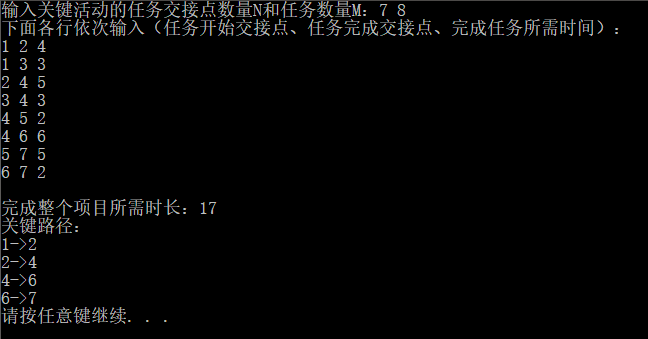
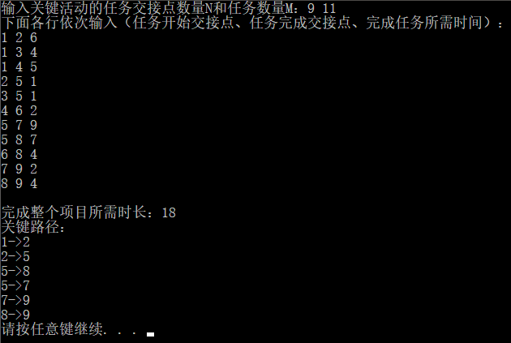
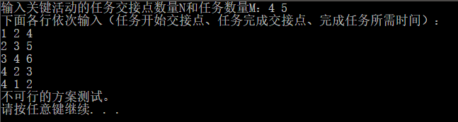

# 关键活动
## 1 项目功能分析
### 1.1 项目简介
本实验项目是要求在任务调度问题中，如果还给出了完成每个字任务需要的时间，则可以算出完成整个工程项目需要的最短时间。在这些子任务中，有些任务即使推迟几天完成，也不会影响全局的工期；但是有些任务必须准时完成，否则整个项目的工期就要因此而延误，这些任务叫做“关键活动”。
### 1.2 项目功能
程序判定一个给定的工程项目的任务调度是否可行；如果该调度方案可行，则计算完成整个项目需要的最短时间，并且输出所有的关键活动。
## 2 程序设计
### 2.1 数据结构设计
**class Edge**
|类型|名称|说明|
|:-:|:-:|:-:|
|int|name|记录邻点序号|
|int|cost|记录边的权|
|Edge*|next|指针指向下一个邻边|
**class Point**
|类型|名称|说明|
|:-:|:-:|:-:|
|int|name|结点序号|
|Edge*|adj|存储结点的邻边|
|void|appendEdge(Edge*e)|使用函数appendEdge(Edge*e)给结点附加邻边|
**class Path**
|类型|名称|说明|
|:-:|:-:|:-:|
|int|begin|记录关键路径的头结点|
|int|end|记录关键路径的尾结点|

**class CriticalPath**
|类型|名称|说明|
|:-:|:-:|:-:|
|int|PointNum|存储结点个数|
|Point*|point|存储结点信息|
|int*|indegree|入度信息数组|
|int*|Vearly|Vearly数组|
|int*|Vlate|Vlate数组|
|stack<Path>|criticalPath|存储最后得到的关键路径|

|名称|说明|
|:-:|:-:|
|bool TopologicalSort()|顺逆拓扑排序，计算关键路径。|
|void printPath()|打印关键路径|

### 2.2 程序设计
**直接在CriticalPath()构造时开始输入数据初始化**
```c
CriticalPath::CriticalPath()
{
    int TaskNum;
    cout << "输入关键活动的任务交接点数量N和任务数量M：";
    cin >> PointNum >> TaskNum;

    //初始化邻接表等
    point = new Point[PointNum];
    indegree = new int[PointNum];
    Vearly = new int[PointNum];
    Vlate = new int[PointNum];
    for (int i = 0; i < PointNum; i++)
    {
        point[i].name = i;
        indegree[i] = 0;
        Vearly[i] = 0;
        Vlate[i] = INT_MAX;
    }

    cout << "下面各行依次输入（任务开始交接点、任务完成交接点、完成任务所需时间）：" << endl;
    for (int i = 0; i < TaskNum; i++)
    {
        int a, b, cost;
        cin >> a >> b >> cost;
        //添加到邻接表中
        point[a - 1].appendEdge(new Edge(b - 1, cost));
        //更新indegree数组
        indegree[b - 1]++;
    }

    //利用拓扑排序的返回值，观测是否能够得到完整的关键路径。如果返回false，则说明存在回路或其他情况。
    if (TopologicalSort())
    {
        printPath();
    }
    else
    {
        cout << "不可行的方案测试。" << endl;
    }
}
```

**TopologicalSort()**
```c
bool CriticalPath::TopologicalSort()
{
    int top = -1;	//栈顶指针
    int* topologicalPath = new int[PointNum];	//拓扑序列
    for (int i = 0; i < PointNum; i++)
    {
        if (indegree[i] == 0)
        {
            indegree[i] = top;
            top = i;
        }
    }

    int topoIndex = 0;
    while (top != -1)	//栈不为空
    {
        int lastTop = top;	//存下刚刚加入拓扑序列的点序号
        top = indegree[top];	//退栈

        Edge* edge = point[lastTop].adj;	//Top点的所有邻边
        topologicalPath[topoIndex] = lastTop;	//输出拓扑序列
        topoIndex++;

        while (edge != nullptr)
        {
            indegree[edge->name]--;
            Vearly[edge->name] = max(Vearly[edge->name], Vearly[lastTop] + edge->cost);		//更新Vearly数组
            if (indegree[edge->name] == 0)
            {
                indegree[edge->name] = top;
                top = edge->name;
            }
            edge = edge->next;
        }
    }

    if (topoIndex < PointNum)return false;	//拓扑序列不涵盖活动网络图中所有结点，说明有回路。

    //倒序更新Vlate，顺便计算关键路径
    Vlate[topoIndex - 1] = Vearly[topoIndex - 1];
    for (int i = topoIndex - 2; i > -1; i--)
    {
        Edge* edge = point[i].adj;
        while (edge != nullptr)
        {
            Vlate[i] = min(Vlate[edge->name] - edge->cost, Vlate[i]);	//计算Vlate;
            edge = edge->next;
        }
        //计算当前点是否有关键路径
        edge = point[i].adj;
        while (edge != nullptr)
        {
            if (Vlate[edge->name] - edge->cost == Vearly[i])
            {
                Path p;
                p.begin = i;
                p.end = edge->name;
                criticalPath.push(p);
            }
            edge = edge->next;
        }
    }

    delete[]topologicalPath;
    return true;
}
```
**printPath()**
```c
void CriticalPath::printPath()
{
    cout << endl;
    cout << "完成整个项目所需时长：" << Vearly[PointNum - 1] << endl;
    cout << "关键路径：" << endl;
    while (criticalPath.size() != 0)
    {
        auto p = criticalPath.top();
        cout << p.begin + 1 << "->" << p.end + 1 << endl;
        criticalPath.pop();
    }
    return;
}
```
输出最终的关键路径，按题目要求应逆序输出，所以应用栈存储关键路径。

## 3 运行状况
### 3.1 测试功能
**简单情况测试**



**一般情况测试**



**不可行情况测试**



### 3.2 测试数据
**简单情况测试**
```
7 8
1 2 4
1 3 3
2 4 5
3 4 3
4 5 2
4 6 6
5 7 5
6 7 2
```
**一般情况测试**
```
9 11
1 2 6
1 3 4
1 4 5
2 5 1
3 5 1
4 6 2
5 7 9
5 8 7
6 8 4
7 9 2
8 9 4
```
**不可行情况测试**
```
4 5
1 2 4
2 3 5
3 4 6
4 2 3
4 1 2
```